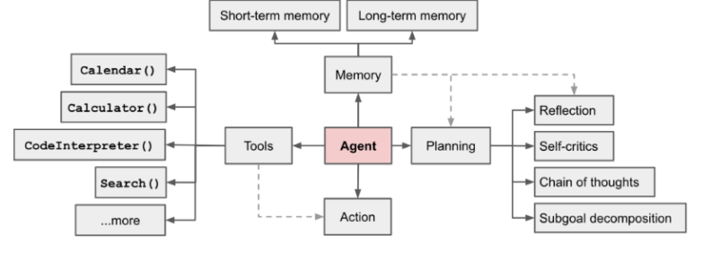
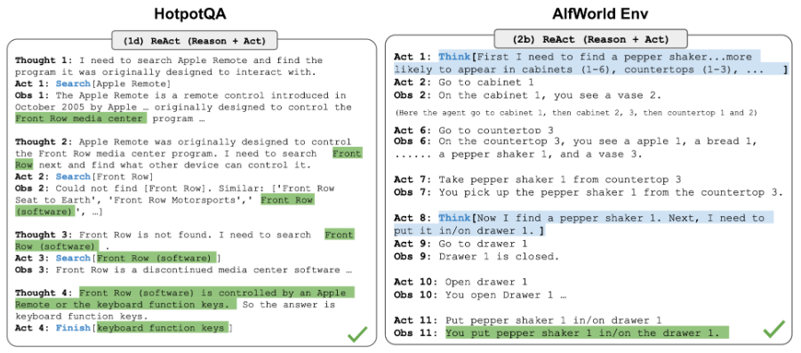
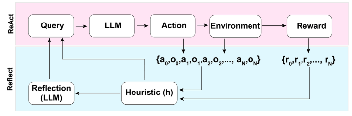
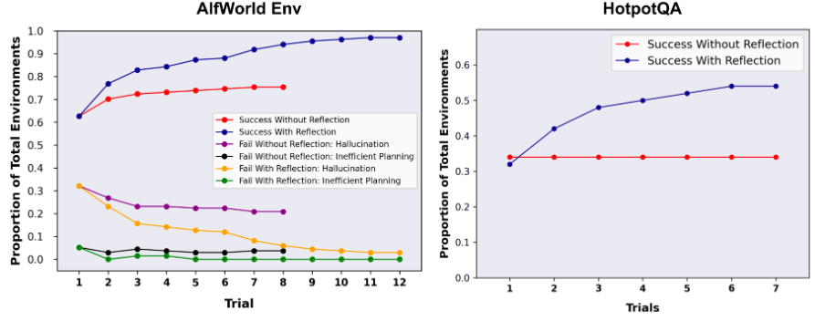
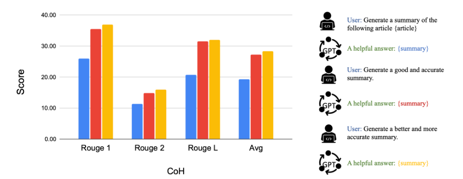
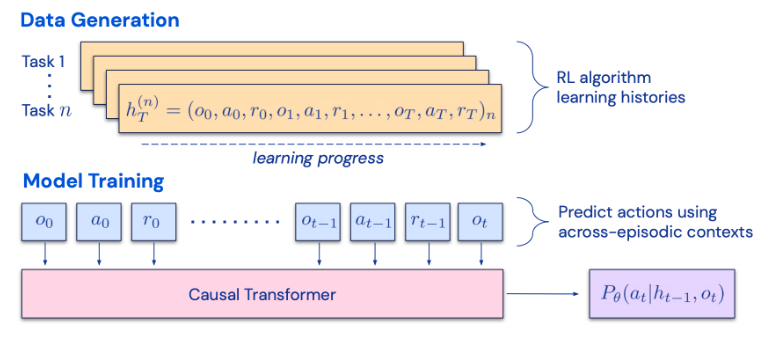
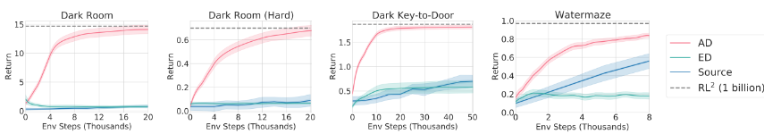
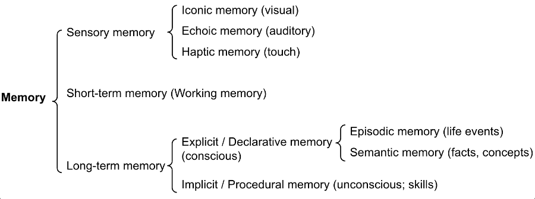
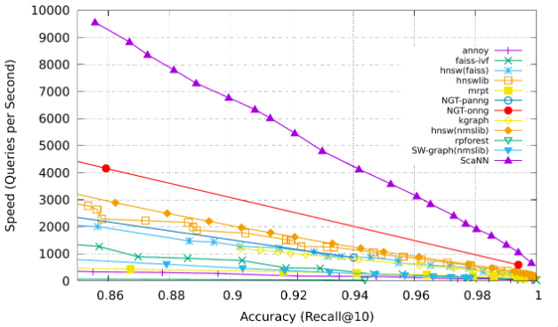

# LLM Powered Autonomous Agents (Agentes Autônomos alimentados por LLM)

Este artigo trata-se de uma tradução realizada por Aurineque da Costa, aluno da Universidade Federal Rural de Pernambuco, como uma iniciativa do projeto de extensão Aprende.ai

Link para artigo original em Inglês: https://lilianweng.github.io/posts/2023-06-23-agent/#component-two-memory

## Sumário

- [Visão geral do sistema do agente](#visão-geral-do-sistema-do-agente)
- [Primeiro componente: Planejamento](#primeiro-componente-planejamento)
  - [Decomposição de Tarefas](#decomposição-de-tarefas)
  - [Auto-reflexão](#auto-reflexão)
- [Componente Dois: Memória](#componente-dois-memória)
  - [Tipos de Memória](#tipos-de-memória)
  - [Pesquisa de Máximo Produto Interno (MIPS)](#pesquisa-de-máximo-produto-interno-mips)
- [Componente Três: Uso de Ferramentas](#componente-três-uso-de-ferramentas)

Construir agentes com LLM (ingl., grande modelo de linguagem) como controlador principal é um conceito interessante. Existem várias demonstrações de prova de conceito, como [AutoGPT](https://github.com/Significant-Gravitas/Auto-GPT), [GPT-Engineer](https://github.com/AntonOsika/gpt-engineer) e [BabyAGI](https://github.com/yoheinakajima/babyagi), que servem como exemplos inspiradores. A potencialidade do LLM vai além da boa geração de cópias, histórias, ensaios e programas; pode ser enquadrado como um poderoso solucionador de problemas gerais.

## Visão geral do sistema do agente

Em um sistema de agente autônomo alimentado por LLM, o LLM funciona como o cérebro do agente, complementado por vários componentes chave: 

- Planejamento 
    ####
  - Sub-objetivo e decomposição: O agente divide tarefas grandes em tarefas menores e gerenciáveis, permitindo o tratamento eficiente de tarefas complexas. 
  ####
  - Reflexão e refinamento: O agente pode fazer autocrítica e autorreflexão sobre ações passadas, aprender com os erros e refina-los para passos futuros, melhorando assim a qualidade dos resultados finais. 
####
- Memória
    ####
   - Memória de curto prazo: eu consideraria todo o aprendizado no contexto (consulte [Prompt Engineering](https://lilianweng.github.io/posts/2023-03-15-prompt-engineering/)) como uma utilização da memória de curto prazo do modelo para aprender.
    ####
  - Memória de longo prazo: fornece ao agente a capacidade de reter e recuperar informações (infinitas) por longos períodos, muitas vezes aproveitando um armazenamento de vetores externo e uma recuperação rápida. 
####

- Uso de ferramentas 
    ####
  - O agente aprende a chamar APIs externas para obter informações extras que estão faltando nos pesos do modelo (muitas vezes difíceis de alterar após o pré-treinamento), incluindo informações atuais, capacidade de execução de código, acesso a fontes de informações proprietárias e muito mais.

## Primeiro componente: Planejamento

Uma tarefa complicada geralmente envolve muitas etapas. Um agente precisa saber o que são e planejar com antecedência.

### Decomposição de Tarefas

[A cadeia de pensamento](https://lilianweng.github.io/posts/2023-03-15-prompt-engineering/#chain-of-thought-cot) (CoT; [Wei et al. 2022](https://arxiv.org/abs/2201.11903)) tornou-se uma técnica de prompt padrão para melhorar o desempenho do modelo em tarefas complexas. O modelo é instruído a “pensar passo a passo” para utilizar mais computação em tempo de teste para decompor tarefas difíceis em etapas menores e mais simples. CoT transforma grandes tarefas em múltiplas tarefas gerenciáveis ​​e esclarece uma interpretação do processo de pensamento do modelo. 

Árvore de pensamentos ([Yao et al. 2023](https://arxiv.org/abs/2305.10601)) estende o CoT explorando múltiplas possibilidades de raciocínio em cada etapa. Primeiro, ele decompõe o problema em várias etapas de pensamento e gera vários pensamentos por etapa, criando uma estrutura em árvore. O processo de pesquisa pode ser BFS(ingl., pesquisa em largura) ou DFS(ingl., pesquisa em profundidade) com cada estado avaliado por um classificador (por meio de um prompt) ou voto majoritário. 

A decomposição da tarefa pode ser feita (1) pelo LLM com solicitações simples como "Etapas para XYZ?", "Quais são os sub-objetivos para alcançar XYZ?", (2) usando instruções específicas da tarefa; por exemplo. "Escreva um esboço da história." para escrever um romance, ou (3) com contribuições humanas.

Outra abordagem bastante distinta, LLM+P ([Liu et al. 2023](https://arxiv.org/abs/2304.11477)), envolve contar com um planejador clássico externo para fazer o planejamento de longo prazo. Esta abordagem utiliza a Linguagem de Definição de Domínio de Planejamento (PDDL, ingl.) como uma interface intermediária para descrever o problema de planejamento. Neste processo, o LLM (1) traduz o problema em “Problema PDDL”, então (2) solicita a um planejador clássico para gerar um plano PDDL baseado em um “PDDL de domínio” existente e, finalmente, (3) traduz o plano PDDL de volta para linguagem natural. Essencialmente, a etapa de planejamento é terceirizada para uma ferramenta externa, assumindo a disponibilidade de PDDL específico do domínio e um planejador adequado, o que é comum em certas configurações robóticas, mas não em muitos outros domínios.

### Auto-reflexão

A autorreflexão é um aspecto vital que permite que os agentes autônomos melhorem iterativamente, refinando decisões de ação passadas e corrigindo erros anteriores. Ele desempenha um papel crucial em tarefas do mundo real, onde tentativa e erro são inevitáveis.

ReAct ([Yao et al. 2023](https://arxiv.org/abs/2210.03629)) integra raciocínio e ação dentro do LLM, estendendo o espaço de ação para ser uma combinação de ações discretas específicas da tarefa e o espaço da linguagem. O primeiro permite que o LLM interaja com o ambiente (por exemplo, use a API de pesquisa da Wikipedia), enquanto o último solicita que o LLM gere traços de raciocínio em linguagem natural.

O modelo de prompt ReAct incorpora etapas explícitas para o LLM pensar, formatadas aproximadamente como:

Pensamento: ...

Ação: ...

Observação: ...

... (Repetido várias vezes)

Fig. 2. Exemplos de trajetórias de raciocínio para tarefas intensivas em conhecimento (por exemplo, HotpotQA, FEVER) e tarefas de tomada de decisão (por exemplo, AlfWorld Env, WebShop). (Fonte da imagem: [Yao et al. 2023](https://arxiv.org/abs/2210.03629)).

Em ambos os experimentos sobre tarefas intensivas em conhecimento e tarefas de tomada de decisão, o ReAct apresenta um desempenho melhor do que a linha de base apenas com Ação, onde o passo Pensamento: … é removido.

Reflexão ([Shinn & Labash 2023](https://arxiv.org/abs/2303.11366)) é uma estrutura que equipa agentes com memória dinâmica e capacidades de auto-reflexão para melhorar habilidades de raciocínio. O Reflexão tem uma configuração padrão de RL(ingl., aprendizagem por reforço), na qual o modelo de recompensa fornece uma recompensa binária simples e o espaço de ação segue a configuração do ReAct, onde o espaço de ação específico da tarefa é aumentado com linguagem para permitir passos de raciocínio complexos. Após cada ação \( a \), o agente calcula uma heurística \( h \) e opcionalmente pode decidir redefinir o ambiente para iniciar um novo teste, dependendo dos resultados da auto-reflexão.

Fig. 3. Ilustração da estrutura Reflexão. (Fonte da imagem: [Shinn & Labash, 2023](https://arxiv.org/abs/2303.11366))

A função heurística determina quando a trajetória é ineficiente ou contém alucinações e deve ser interrompida. Planejamento ineficiente refere-se a trajetórias que demoram muito sem sucesso. Alucinação é definida como encontrar uma sequência de ações idênticas consecutivas que levam à mesma observação no ambiente.

A auto-reflexão é criada mostrando exemplos de duas etapas ao LLM, e cada exemplo é um par de (trajetória falha, reflexão ideal para orientar mudanças futuras no plano). Em seguida, as reflexões são adicionadas à memória de trabalho do agente, até três, para serem usadas como contexto para consultar o LLM.

Fig. 4. Experimentos no AlfWorld Env e HotpotQA. Alucinação é uma falha mais comum do que o planejamento ineficiente no AlfWorld. (Fonte da imagem: [Shinn & Labash, 2023](https://arxiv.org/abs/2303.11366))

Cadeia de Reflexão (CoH; [Liu et al. 2023](https://arxiv.org/abs/2302.02676)) incentiva o modelo a melhorar suas próprias saídas apresentando-lhe explicitamente uma sequência de saídas passadas, cada uma anotada com feedback. Os dados de feedback humano são uma coleção de \( D_h = \{(x , y_i , r_i , z_i )\}\stackrel{n}{i} = 1  \), onde \( x \) é o prompt, cada \( y_i \) é uma conclusão do modelo, \( r_i \) é a avaliação humana de \( y_i \), e \( z_i \) é o feedback correspondente fornecido pelo humano. Assume-se que as tuplas de feedback são classificadas por recompensa, $r_n \geq r\underset{n-1}{} \geq \cdots \geq r_1$. O processo é um ajuste fino supervisionado, onde os dados são uma sequência na forma de \( th = (x, z_i, y_i, z_j,y_j \ldots, z_n, y_n) \), onde $ \leq i \leq j \leq n$. O modelo é ajustado para prever apenas \( y_n \) condicionado ao prefixo da sequência, de modo que o modelo possa auto-refletir para produzir uma saída melhor com base na sequência de feedback. O modelo pode opcionalmente receber várias rodadas de instruções com anotadores humanos no momento do teste.

Para evitar overfitting, o CoH adiciona um termo de regularização para maximizar a verossimilhança do conjunto de dados de pré-treinamento. Para evitar atalhos e cópias (porque há muitas palavras comuns nas sequências de feedback), eles mascaram aleatoriamente de 0% à 5% dos tokens passados durante o treinamento.

O conjunto de dados de treinamento em seus experimentos é uma combinação de [comparações do WebGPT](https://huggingface.co/datasets/openai/webgpt_comparisons), [resumo com feedback humano](https://github.com/openai/summarize-from-feedback) e [conjunto de dados de preferência humana](https://github.com/anthropics/hh-rlhf).

Fig. 5. Após o ajuste fino com CoH, o modelo pode seguir instruções para produzir saídas com melhorias incrementais em uma sequência. (Fonte da imagem: [Liu et al. 2023](https://arxiv.org/abs/2302.02676))

A ideia do CoH é apresentar um histórico de saídas melhoradas sequencialmente no contexto e treinar o modelo para seguir a tendência e produzir saídas melhores. O **Algorithm Distillation** (AD; [Laskin et al. 2023](https://arxiv.org/abs/2210.14215)) aplica a mesma ideia às trajetórias entre episódios em tarefas de aprendizado por reforço, onde um algoritmo é encapsulado em uma política condicionada por um longo histórico. Considerando que um agente interage com o ambiente muitas vezes e em cada episódio o agente melhora um pouco, o AD concatena esse histórico de aprendizado e o alimenta no modelo. Portanto, devemos esperar que a próxima ação prevista leve a um desempenho melhor do que os testes anteriores. O objetivo é aprender o processo de RL(ingl., aprendizagem por reforço) em vez de treinar uma política específica para a tarefa em si.

Fig. 6. Ilustração de como o Algorithm Distillation (AD) funciona. (Fonte da imagem: [Laskin et al. 2023](https://arxiv.org/abs/2210.14215)).

O artigo hipotetiza que qualquer algoritmo que gere um conjunto de históricos de aprendizado pode ser destilado em uma rede neural realizando clonagem comportamental sobre as ações. Os dados históricos são gerados por um conjunto de políticas-fonte, cada uma treinada para uma tarefa específica. Na fase de treinamento, durante cada execução de RL, uma tarefa aleatória é amostrada e uma subsequência de histórico multi-episódio é usada para treinamento, de modo que a política aprendida seja independente da tarefa.

Na realidade, o modelo tem um comprimento de janela de contexto limitado, então os episódios devem ser curtos o suficiente para construir um histórico multi-episódio. Contextos multi-episódicos de 2 à 4 episódios são necessários para aprender um algoritmo de RL quase ótimo em contexto. O surgimento do RL em contexto requer um contexto suficientemente longo.

Em comparação com três linhas de base, incluindo ED (destilação de especialistas, clonagem comportamental com trajetórias de especialistas em vez de histórico de aprendizado), política-fonte (usada para gerar trajetórias para destilação pelo [UCB](https://lilianweng.github.io/posts/2018-01-23-multi-armed-bandit/#upper-confidence-bounds)), RL^2 ([Duan et al. 2017](https://arxiv.org/abs/1611.02779); usado como limite superior, pois necessita de RL online), o AD demonstra RL em contexto com desempenho próximo ao RL^2, apesar de usar apenas RL offline, e aprende muito mais rápido do que outras linhas de base. Quando condicionado ao histórico de treinamento parcial da política-fonte, o AD também melhora muito mais rápido do que a linha de base ED.

Fig. 7. Comparação entre AD, ED, política-fonte e RL^2 em ambientes que requerem memória e exploração. Apenas uma recompensa binária é atribuída. As políticas-fonte são treinadas com [A3C](https://lilianweng.github.io/posts/2018-04-08-policy-gradient/#a3c) para ambientes "escuros" e [DQN](http://lilianweng.github.io/posts/2018-02-19-rl-overview/#deep-q-network) para o labirinto aquático.(Fonte da imagem: [Laskin et al. 2023](https://arxiv.org/abs/2210.14215))

## Componente Dois: Memória

(Muito obrigado ao ChatGPT por me ajudar a redigir esta seção. Aprendi muito sobre o cérebro humano e a estrutura de dados para MIPS rápidos em minhas [conversas](https://chat.openai.com/share/46ff149e-a4c7-4dd7-a800-fc4a642ea389) com o ChatGPT.)

### Tipos de Memória

A memória pode ser definida como os processos usados para adquirir, armazenar, reter e posteriormente recuperar informações. Existem vários tipos de memória no cérebro humano.

**Memória Sensorial**: Este é o estágio mais inicial da memória, proporcionando a capacidade de reter impressões de informações sensoriais (visuais, auditivas, etc.) após o estímulo original ter terminado. A memória sensorial geralmente dura apenas alguns segundos. As subcategorias incluem memória icônica (visual), memória ecoica (auditiva) e memória háptica (tato).

**Memória de Curto Prazo** (MCP) ou **Memória de Trabalho**: Armazena informações das quais estamos atualmente conscientes e é necessária para realizar tarefas cognitivas complexas, como aprender e raciocinar. Acredita-se que a memória de curto prazo tenha uma capacidade de cerca de 7 itens ([Miller 1956](https://lilianweng.github.io/posts/2023-06-23-agent/psychclassics.yorku.ca/Miller/)) e dura de 20 a 30 segundos.

**Memória de Longo Prazo** (MLP): A memória de longo prazo pode armazenar informações por um tempo notavelmente longo, variando de alguns dias a décadas, com uma capacidade de armazenamento essencialmente ilimitada. Existem dois subtipos de MLP:

Memória Explícita / Declarativa: Esta é a memória de fatos e eventos e refere-se àquelas memórias que podem ser conscientemente recuperadas, incluindo a memória epidódica (eventos e experiências) e a memória semântica (fatos e conceitos).

Memória Implícita / Procedural: Este tipo de memória é inconsciente e envolve habilidades e rotinas que são realizadas automaticamente, como andar de bicicleta ou digitar em um teclado.

Fig. 8. Categorização da memória humana.

Podemos considerar aproximadamente os seguintes mapeamentos:

- Memória sensorial como a representação de embeddings de aprendizado para entradas brutas, incluindo texto, imagem ou outras modalidades;
- Memória de curto prazo como aprendizado em contexto. Ela é curta e finita, pois é restrita pelo comprimento do contexto finito da janela do Transformer.
- Memória de longo prazo como o armazenamento externo de vetores que o agente pode acessar no momento da consulta, acessível via recuperação rápida.

### Pesquisa de Máximo Produto Interno (MIPS)

A memória externa pode aliviar a restrição do tempo de atenção finito. Uma prática comum é salvar a representação em embedding da informação em um banco de dados de vetores que pode suportar uma busca rápida por produto interno máximo ([MIPS](https://en.wikipedia.org/wiki/Maximum_inner-product_searc)). Para otimizar a velocidade de recuperação, a escolha comum é o algoritmo de vizinhos mais próximos aproximados (ANN) para retornar aproximadamente os k vizinhos mais próximos, trocando um pouco de precisão por um grande aumento de velocidade.

Algumas escolhas comuns de algoritmos ANN para MIPS rápido:

- **[LSH](https://en.wikipedia.org/wiki/Locality-sensitive_hashing)** (Locality-Sensitive Hashing): Introduz uma função de hashing tal que itens de entrada semelhantes são mapeados para os mesmos buckets com alta probabilidade, onde o número de buckets é muito menor que o número de entradas.
- **[ANNOY](https://github.com/spotify/annoy)**(Approximate Nearest Neighbors Oh Yeah): A estrutura de dados principal são árvores de projeção aleatória, um conjunto de árvores binárias onde cada nó não-folha representa um hiperplano dividindo o espaço de entrada pela metade e cada folha armazena um ponto de dados. As árvores são construídas de forma independente e aleatória, então, até certo ponto, imitam uma função de hashing. A busca ANNOY ocorre em todas as árvores para iterativamente buscar através da metade mais próxima da consulta e depois agrega os resultados. A ideia está bastante relacionada à árvore KD, mas é muito mais escalável.
- **[HNSW](https://arxiv.org/abs/1603.09320)** (Hierarchical Navigable Small World): É inspirado na ideia de redes de pequenos mundos, onde a maioria dos nós pode ser alcançada por qualquer outro nó em um pequeno número de passos; por exemplo, a característica "seis graus de separação" das redes sociais. HNSW constrói camadas hierárquicas dessas grafos de pequenos mundos, onde as camadas inferiores contêm os pontos de dados reais. As camadas intermediárias criam atalhos para acelerar a busca. Ao realizar uma busca, HNSW começa de um nó aleatório na camada superior e navega em direção ao alvo. Quando não pode chegar mais perto, desce para a próxima camada, até alcançar a camada inferior. Cada movimento nas camadas superiores pode potencialmente cobrir uma grande distância no espaço de dados, e cada movimento nas camadas inferiores refina a qualidade da busca.
- **[FAISS](https://github.com/facebookresearch/faiss)** (Facebook AI Similarity Search): Opera com a suposição de que, em um espaço de alta dimensão, as distâncias entre nós seguem uma distribuição Gaussiana e, portanto, deve existir um agrupamento de pontos de dados. FAISS aplica quantização vetorial, particionando o espaço vetorial em clusters e, em seguida, refinando a quantização dentro dos clusters. A busca primeiro procura candidatos a clusters com quantização grosseira e depois examina cada cluster com quantização mais fina.
- **[ScaNN](https://github.com/google-research/google-research/tree/master/scann)** (Scalable Nearest Neighbors): A principal inovação no ScaNN é a quantização vetorial anisotrópica. Ele quantiza um ponto de dados \( \mathbf{x}_i \) para \( \mathbf{\tilde{x}}_i \) de modo que o produto interno (\( \ q, \mathbf{x}_i \)) seja o mais semelhante possível à distância original de \( \angle q, \mathbf{\tilde{x}}_i \) em vez de escolher os pontos centroids de quantização mais próximos.

Fig. 9. Comparação de algoritmos MIPS, medida em recall@10. (Fonte da imagem: [Google Blog, 2020](https://ai.googleblog.com/2020/07/announcing-scann-efficient-vector.html)) 

Confira mais algoritmos MIPS e comparação de desempenho em [ann-benchmarks.com](https://ann-benchmarks.com/).

## Componente Três: Uso de Ferramentas

